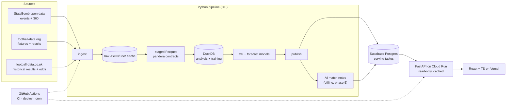

# PITCHLENS — PROJECT SPECIFICATION v1.0

> **Status:** Source of truth · **Version:** 1.0 · **Date:** 2026-10-01 · **Phase:** 0 (no production code yet)
>
> This document consolidates every decision made while planning PitchLens: the original project plan page, the later Technologies / hosting decisions, the technology roadmap, the interactive roadmap and the Claude Project setup. Where an older version of the plan page conflicts with a later decision, **the later decision wins**, and section 0.3 lists each case.
>
> It supersedes `PITCHLENS_CONTEXT.md` and both earlier artifacts (the plan page and the interactive roadmap). Those should be regenerated from this file, not the other way round.

---

## 0. How to read this document

### 0.1 Status markers

| Marker | Meaning |
|---|---|
| ✅ **Decided** | Agreed earlier. Change it only with a new ADR. |
| 🟡 **Proposed** | New detail added here to make the plan executable (schemas, endpoints, file names, workflow rules). Adopt it by default; object in a PR. |
| ❓ **Open** | Not decided. Listed in section 26 with a recommendation. Nobody should silently pick an answer. |

Anything without a marker inherits the marker of its section heading.

### 0.2 Mission

**Two software engineers → capable football data analysts → with a serious, technically strong and analytically credible public football analytics portfolio project.**

Every technology in this spec exists because it contributes to PitchLens. Every football analytics concept is tied to something we actually build. If a tool or concept can't point to a file, a page or a write-up, it doesn't belong here.

### 0.3 Contradictions resolved (later decision wins)

| Topic | Older plan page said | Later decision (binding) |
|---|---|---|
| Frontend hosting | "Cloudflare Pages or Vercel" | **Vercel** (Hobby plan) |
| API hosting | "Google Cloud Run or Fly.io" | **Google Cloud Run** |
| Postgres usage | "the small set of tables the website needs" | Same, made explicit: **only summary tables and shots in Postgres; full event data stays in Parquet** (500 MB free cap) |
| Supabase projects | one project implied | **Separate dev and prod Supabase projects** |
| Frontend framework | React + Vite (no alternative named) | React + Vite **chosen over Next.js** (recorded explicitly) |
| Python packaging | uv | uv **chosen over Poetry** (recorded explicitly) |
| Orchestration | "GitHub Actions cron is your scheduler" | Same: **CLI + scheduled GitHub Actions, chosen over Airflow** |
| Elo baseline owner | Roadmap phase 4: Person A builds Elo. Work-split section: "B crosses over by building the Elo baseline" | ❓ **Open:** the old page contradicts itself. See Q-07. |

---

## 1. Product vision ✅

**One line.** PitchLens is an open football analytics lab: our own xG model, match reports anyone can read, and a forecast that publicly keeps score of itself.

**Principle.** *Show the numbers and show the method.* Every match page explains itself. The xG model is ours and benchmarked in the open. The forecast publishes its own track record, including the weeks it gets wrong.

**Problem.** Most public football stats show numbers without methods. Open advanced data got scarcer in January 2026, when FBref had to delete its Opta-powered advanced stats. Learners and fans have few places where the model, the code and its errors are all visible.

**Users, in honest order of importance.**
1. Recruiters, club analysts and hiring managers reading our portfolios.
2. Us two, as a structured way to learn football analytics.
3. Curious fans and amateur writers who want readable match visuals.

**Why it's interesting.** Two moments of accountability: we will disagree with a professional xG model and have to explain why, and our forecasts are scored publicly. Those make better portfolio stories than another dashboard.

**Shape: three layers plus an optional lab.**

| Layer | What | Data | Can it break when an API changes? |
|---|---|---|---|
| Static core | xG model, match pages, competition pages, methods | StatsBomb open data (historical) | No |
| Live layer | Weekly forecasts with a public track record | football-data.org + football-data.co.uk | Yes, by design: it gives us a real pipeline to operate |
| AI layer | Short match notes describing computed numbers | Our own computed stats | No: generated offline |
| Video lab (optional) | Per-player positions and physical metrics from our own footage | Our own video | n/a: offline batch |

**Constraints and assumptions ✅**
- Two engineers, roughly 6–10 hours a week each.
- About 16 weeks to a polished launch, plus an optional 6-week video lab.
- Python for data work.
- Budget close to zero: the target running cost is €0–10 a month.
- Public and **non-commercial**. This is required by the Vercel Hobby plan and the data terms.
- **Name:** "PitchLens". ❓ Domain, GitHub org and app-store availability still need to be checked (Q-01).

---

## 2. MVP scope ✅ (phases 0–3)

**The MVP is done when** a stranger can open a public URL, pick a match, and understand what happened beyond the score.

| # | Feature | Definition |
|---|---|---|
| M1 | Reproducible dataset | Ingest StatsBomb open data for **2–3 competitions** (for example a World Cup, a Euros and one full league season) with one command. ❓ Exact competitions: Q-02 |
| M2 | xG model v1 | Logistic regression on distance, angle, body part and play type. Evaluated with log loss, Brier score and a calibration plot, side by side with StatsBomb's own xG. |
| M3 | Match page | Shot map, cumulative xG timeline, pass network, small key-stats table, all drawn from our pipeline. |
| M4 | Competition page | Team xG for and against, per 90, with a short note on what "per 90" means and why small samples mislead. |
| M5 | Methods page | A plain-language model card: data used, features, metrics, known blind spots. Also holds data attribution (StatsBomb credit and logo). |
| M6 | Deployed with CI | Tests on every pull request, automatic deploy from `main`, a public URL. |

**Explicitly not in the MVP:** forecasts, AI notes, player pages, xG v2, share images, video.

**Safe stopping point ✅:** the end of phase 3 (week 9). If life intervenes, the project stops there and is still a complete, deployed portfolio piece.

---

## 3. Post-MVP scope ✅ (phases 4–6, priority order)

| # | Feature | Phase | Notes |
|---|---|---|---|
| F1 | **Weekly forecasts with a track record** | 4 | Elo baseline, then Dixon-Coles, on one current league. Season simulations. A page scoring every past prediction. ❓ League: Q-03 |
| F2 | **AI match notes** | 5 | Written offline from computed stats, with an automated number check. See section 13. |
| F3 | **xG model v2** | 6 | Gradient boosting (LightGBM) plus StatsBomb 360 freeze-frame features (defenders between shooter and goal, keeper position). |
| F4 | **Player percentile pages** | 6 | Per 90, with minimum-minutes thresholds, only for competitions with full seasons. ❓ F3 *or* F4 in phase 6: Q-04 |
| F5 | **Shareable images** | 6 | Export any chart as a PNG with attribution baked in. |
| F6 | **Archive-mode export** | 6 | Export serving tables to static JSON so the site survives without a DB or API. |
| F7 | Tracking sandbox (stretch) | after 6 | Pitch-control demo on public tracking samples (Metrica, SkillCorner), only with spare energy. |
| F8 | "Ask the data" text-to-SQL (experiment) | after 6 | Optional, read-only DB role, only after everything else works. |

---

## 4. Optional video-analysis phase ✅ (phase 7, weeks 17–22, after launch)

**Goal.** Turn our own match footage into per-player positions and movement. This is the literal "lens" in PitchLens.

**First milestone / done when:** a 5-minute clip of our own 7-a-side game produces per-player heatmaps and distance covered, with a **published accuracy figure in metres**.

| Per-player output | Realistic? | How |
|---|---|---|
| Position over time, heatmap | Yes | Detect, track, map pixels to pitch with a homography |
| Distance, speed, sprints | Yes | Derived from positions. Error grows with distance from the camera |
| Team shape, average positions | Yes | Team split by shirt colour (clustering) |
| Who is who (names) | With help | Manual track-naming screen. Shirt-number OCR is unreliable |
| Ball position | Partly | Gaps, filled by interpolation or by hand |
| Passes, shots, tackles | Not yet | Research problem. Semi-manual tagging is the honest route |

**Rules ✅**
- **Footage:** our own games (or a local club's with permission), from a single **fixed, elevated, wide** camera. **No TV broadcasts**: they are technically hard (zooms, cuts, replays) and copyrighted.
- **Consent** from everyone shown before publishing anything. Prefer initials or anonymised IDs.
- **Pipeline:** YOLO-family detector, fine-tuned on a few hundred labelled frames from our camera → multi-object tracker (ByteTrack) → homography from pitch keypoints or manually clicked corners → team assignment by shirt colour → table `frame, track_id, team, x, y` in **PitchLens pitch coordinates**, so existing charts work unchanged.
- **Compute:** needs a GPU. It runs as an **offline batch job** on a free notebook GPU or a rented one, **never inside the web API**.
- **Evaluation:** hand-label 100 frames and report position error in metres. The evaluation is what makes it a portfolio piece.
- **Starting points:** Roboflow's sports repository and the SoccerNet datasets.

---

## 5. Football analytics objectives

What we must be able to *do and explain* by the end. Each objective is tied to a deliverable.

| # | Objective | Proven by | Phase |
|---|---|---|---|
| A1 | Read and reason about event data: event types, possessions, play patterns, coordinates | Staged Parquet + pandera contracts + EDA notebook | 1 |
| A2 | Handle coordinate systems correctly (StatsBomb 120 × 80, origin top-left; attacking direction) | Transform tests + correct shot maps | 0–1 |
| A3 | Build, evaluate and **calibrate** an xG model; avoid leakage; compare with a professional model | Model card + write-up #1 | 2 |
| A4 | Use per-90 rates honestly (minimum minutes; small-sample caveats) | Competition page notes | 3 |
| A5 | Read and build pass networks; know their limits (substitutions, average positions) | Match page pass network | 3 |
| A6 | Rate teams (Elo, Dixon-Coles), simulate seasons, score probabilistic forecasts (RPS, Brier, log loss), benchmark against bookmaker odds | Forecast + track-record pages, write-up #2 | 4 |
| A7 | Turn numbers into accurate prose; know what a model can and can't claim | Faithfulness-tested AI notes + "how to read this" texts | 5 |
| A8 | Use richer context (360 freeze frames) **or** build player profiles with percentiles | xG v2 or player pages + final write-up | 6 |
| A9 | Communicate uncertainty and limitations publicly | Methods page, model cards, write-ups | 2–6 |
| A10 | (optional) Work with tracking data: homography, physical metrics, measurement error | Video lab accuracy report | 7 |

Concepts in the analytics vocabulary we must be able to explain: event data, tracking data, xG, per 90, pass network, PPDA, calibration, Brier score, log loss, ranked probability score, Elo, Dixon-Coles. Glossary values ✅ we will reuse: a penalty is about 0.76–0.79 xG; a 30-metre shot about 0.02–0.04; per-90 numbers are unreliable below roughly 900 minutes.

---

## 6. Data sources and data strategy ✅

### 6.1 Sources

| Source | Role | Access / cost | Licensing and caveats |
|---|---|---|---|
| **StatsBomb open data** (Hudl) | **Core**: events (~3,400 per match), 360 freeze frames for some competitions | Free JSON on GitHub; `statsbombpy`, no credentials | User agreement for research and genuine interest. **Must credit StatsBomb and use their logo when publishing.** Coverage is selective (tournaments, some full league seasons, many women's competitions), not the current season. |
| **football-data.org** | **Live layer**: fixtures, results, standings for 12 competitions | Free tier, **10 requests/minute**, slightly delayed scores | No player stats or xG on the free tier. Batch only; **cache everything; never call per page view**. Check attribution terms. |
| **football-data.co.uk** | Forecast history: historical results + **closing betting odds** (CSV) | Free downloads | Training forecasts and the bookmaker benchmark. Check terms before redistributing files. |
| Wyscout public dataset (Pappalardo et al., 2019) | Supplement: full 2017/18 seasons of 5 leagues + 2 tournaments | Free download | Open licence with attribution (verify exact licence). Old, but full seasons suit player-profile experiments. |
| API-Football | Only if needed: a league football-data.org lacks | Free: 100 requests/day | Quality varies outside top leagues. |
| Metrica / SkillCorner samples | Stretch: tracking sandbox | Free on GitHub | Too few matches for general conclusions. |
| **FBref** | **Avoid** | — | Advanced data removed in January 2026 after Opta ended the agreement; scraping discouraged. |
| **Understat, Sofascore, FotMob, WhoScored, Transfermarkt** | **Avoid** | Scraping only | Terms generally prohibit scraping and republishing. |

### 6.2 Strategy rules ✅
1. **Only data we're allowed to publish.** No scraping of sites whose terms forbid it.
2. **`docs/DATA_SOURCES.md`** lists every source: licence link, date last checked, attribution shown. Terms are rechecked before launch and each August.
3. **Batch everything.** Football data changes a few times a week: no streaming, no queues.
4. **Raw is immutable and cached.** Never re-download history. Every rerun is idempotent and never duplicates data.
5. **Two committed fixture matches** of StatsBomb JSON in `tests/fixtures/` for CI. (Keep the attribution file next to them. 🟡 Recheck the StatsBomb terms before committing.)
6. **Storage split:** full event data → Parquet/DuckDB (laptops and CI). **Only summary tables and shots → Postgres.**
7. **Selection bias:** StatsBomb open data is a non-random sample of competitions, which is often favourable to particular teams and players. This is stated on the methods page and in every model card.
8. **Season rollover:** a few hours each August. ❓ How long the live layer runs before archive mode: Q-09.

---

## 7. Final technology stack ✅

One choice per job. "Rejected" means considered and not chosen.

| Area | Choice | Rejected / skipped | Introduced in phase |
|---|---|---|---|
| Python tooling | Python 3.12+, **uv**, ruff, mypy, pre-commit | Poetry | 0 |
| Notebooks | Jupyter ❓ or marimo (Q-05) | — | 0 |
| Data | pandas, **DuckDB**, **Parquet**, **pandera** | Spark, warehouses | 1 |
| Football libraries | `statsbombpy`, `mplsoccer`; later `penaltyblog` (Dixon-Coles), `socceraction` (xT/VAEP, optional) | — | 0 / 4 |
| Modelling | scikit-learn, statsmodels; LightGBM for xG v2 | Deep learning (except video) | 2 / 6 |
| Database | **Postgres on Supabase** (dev + prod projects), SQLAlchemy 2, **Alembic** | Self-hosted DB | 2 |
| Backend | **FastAPI**, Pydantic v2, read-only, cached | Django, GraphQL | 3 |
| Frontend | **React + TypeScript + Vite**, TanStack Query, **D3** (pitch), **Observable Plot** (standard charts), `openapi-typescript` | Next.js, charting-library-only pitch | 3 |
| Containers | **One Dockerfile for the API**, **Docker Compose** for local Postgres | Containerised frontend, Kubernetes | 0 (Compose) / 3 (Dockerfile) |
| Frontend hosting | **Vercel Hobby** | Cloudflare Pages | 3 |
| API hosting | **Google Cloud Run** (scale to zero) | Fly.io | 3 |
| CI/CD + scheduler | **GitHub Actions** (+ Dependabot) | Airflow, Terraform, queues | 0 / 4 |
| AI | **Claude API**, structured outputs, **pipeline only** | Browser-side LLM calls | 5 |
| Monitoring | `/health` endpoint, Actions failure emails, Sentry free tier (optional) | Full observability stack | 3–6 |
| Testing | pytest, Hypothesis, pandera, snapshots, httpx TestClient, Vitest, Testing Library, Playwright | — | 0–3 |
| Video (optional) | YOLO-family detector, ByteTrack, OpenCV homography, colour clustering, notebook GPU | Running CV in the API | 7 |
| Docs/diagrams | Markdown, **Mermaid in the repo**, ADRs, model cards | — | 0 |

**Docker policy ✅:** the container is the API's deploy unit. Don't containerise the frontend and don't add Kubernetes.

---

## 8. Architecture ✅

**Rule:** heavy work happens in the pipeline; the API only reads precomputed tables; the frontend only draws.



**Environments ✅:** local (Compose Postgres), preview (Vercel preview URL per PR), production. The dev Supabase project serves local and preview work; the prod project serves production. ❓ Which API a Vercel preview calls: Q-06.

**Archive mode ✅:** before we stop maintaining PitchLens, export the serving tables to static JSON so the site keeps working on static hosting with no database, API or bills.

**Accepted trade-offs ✅ (ADR 0002):**
- A cold-start delay on the first API request after the site has been idle.
- Vercel's non-commercial and one-member limits.
- Supabase's 500 MB cap and inactivity pause. The twice-weekly forecast job keeps the database awake.

---

## 9. Database and data model 🟡

The storage split is ✅ decided. The table designs below are 🟡 proposed: they are the minimum needed to serve the MVP and the forecast layer.

### 9.1 Analytical store (Parquet + DuckDB, not deployed)

```
data/                          # gitignored
  raw/statsbomb/{matches,events,lineups,three-sixty}/*.json
  raw/football_data_org/{competition}/{date}.json
  raw/football_data_co_uk/*.csv
  staged/                      # one Parquet dataset per entity, pandera-validated
    matches.parquet  events.parquet  shots.parquet  passes.parquet
    lineups.parquet  freeze_frames.parquet  results.parquet  odds.parquet
  pitchlens.duckdb             # views over staged/, training sets, marts
```

**Canonical coordinates 🟡:** StatsBomb's 120 × 80 pitch, origin top-left, **normalised so the team in possession attacks left → right**. Every source (including video) converts into this system at the staging step; nothing downstream converts again.

### 9.2 Serving store (Postgres, deployed)

| Table | Key columns | Purpose |
|---|---|---|
| `competition` | id, source, source_competition_id, source_season_id, name, season_name, gender | Competition list |
| `team` | id, name, short_name | Teams (one row per team across sources) |
| `team_source_id` | team_id, source, source_team_id | Maps StatsBomb / football-data.org IDs to one team |
| `player` | id, name, source_player_id | Shooters, network nodes |
| `match` | id, competition_id, kickoff, home_team_id, away_team_id, home_score, away_score, stage, has_360 | Match list and header |
| `shot` | id, match_id, team_id, player_id, period, minute, second, x, y, end_x, end_y, body_part, play_pattern, shot_type, outcome, is_goal, xg_pitchlens, xg_statsbomb, xg_model_version | Shot map, xG timeline (derived client-side), comparisons |
| `team_match_stats` | match_id, team_id, shots, shots_on_target, xg, possession_pct, passes, ppda | Key-numbers table |
| `pass_network_node` / `pass_network_edge` | match_id, team_id, player_id, avg_x, avg_y, touches / passer_id, recipient_id, passes | Pass network (until the first substitution) |
| `team_competition_stats` | competition_id, team_id, matches, minutes, xg_for, xg_against, xg_for_p90, xg_against_p90 | Competition page |
| `model_version` | id, kind (`xg`/`forecast`), name, trained_at, git_sha, metrics (jsonb), card_path | Model cards, provenance |
| `fixture` | id, source_match_id, competition_code, season, matchday, kickoff, home_team_id, away_team_id, status, home_goals, away_goals | Live layer |
| `team_rating` | as_of, team_id, model_version_id, elo, attack, defence | Ratings snapshots |
| `forecast` | id, fixture_id, model_version_id, issued_at, p_home, p_draw, p_away, exp_home_goals, exp_away_goals | **Insert-only.** One row per issue; never updated |
| `forecast_score` | forecast_id, rps, brier, log_loss, bookmaker_rps | Track record |
| `season_simulation` | as_of, competition_code, team_id, exp_points, p_title, p_top4, p_relegation | Season sims |
| `match_note` | match_id, text, claims (jsonb), prompt_version, llm_model, generated_at, faithfulness_passed | AI notes (phase 5) |

**Integrity rules 🟡 (enforced by constraints and tests):**
- `forecast.issued_at < fixture.kickoff`. A forecast published after kick-off is a bug, not a prediction.
- `forecast` rows are never updated or deleted. This is enforced with grants (`api_reader` and `pipeline_writer` have no `UPDATE`/`DELETE` on `forecast`) and asserted in tests.
- `p_home + p_draw + p_away = 1 ± 1e-6`; `0 ≤ xg ≤ 1`.
- Every serving row can be traced to a `model_version` or a source.

**Size budget:** shots plus summary tables for 2–3 competitions are a few MB, far inside the 500 MB cap.

---

## 10. Data pipeline

A Python package with a small CLI. **Idempotent; raw files cached ✅.**

| Command | Does | Phase |
|---|---|---|
| `pitchlens ingest statsbomb --competition … --season …` 🟡 | Download (or reuse cache) → raw | 1 |
| `pitchlens ingest results --source football-data-org` ✅ | Fixtures/results (rate-limited client) | 4 |
| `pitchlens ingest odds --source football-data-co-uk` 🟡 | Historical results + odds CSVs | 4 |
| `pitchlens validate` ✅ | Stage raw → Parquet with pandera contracts; fail loudly | 1 |
| `pitchlens train xg` / `pitchlens evaluate xg` 🟡 | Train, write metrics + calibration plot + model card inputs | 2 |
| `pitchlens publish [core|forecasts|notes] --env {dev,prod}` ✅/🟡 | Upsert serving tables (forecasts insert-only) | 2–5 |
| `pitchlens forecast update --score-last-round` ✅ | Refit ratings, score the last round, issue new forecasts, simulate the season | 4 |
| `pitchlens notes generate` 🟡 | Build stats JSON → Claude API → faithfulness check → store | 5 |
| `pitchlens export archive` 🟡 | Serving tables → static JSON | 6 |

**Where the static core is published from:** ❓ Q-08. Recommendation: a manual `workflow_dispatch` job that re-ingests from the StatsBomb cache (`actions/cache`) and publishes, so prod is never published from someone's laptop.

**Modelling rules ✅/🟡**
- xG v1: logistic regression; features distance, angle, body part, play type. 🟡 Exclude penalties from training and give them a constant xG; treat own goals as non-shots. Document both choices in the model card.
- 🟡 Train/test split **by match** (never by shot), with a held-out competition as a second check, to avoid leakage.
- Forecasts: Elo baseline, then Dixon-Coles (`penaltyblog`). Backtest on historical seasons; score with **RPS** (primary), Brier and log loss; compare with bookmaker implied probabilities after removing the overround.

---

## 11. Backend ✅

FastAPI, **read-only**, Pydantic v2 response models, SQLAlchemy 2, one Docker image on Cloud Run. **API contract first ✅:** agree the OpenAPI spec plus example JSON before building, so the frontend can work against mock data.

**Endpoints 🟡** (version prefix `/v1`; `/matches/{id}/shots` is ✅ from the plan):

```
GET /health
GET /v1/competitions
GET /v1/competitions/{id}/matches
GET /v1/competitions/{id}/team-stats
GET /v1/matches/{id}                    # header + team_match_stats
GET /v1/matches/{id}/shots              # shot map + xG timeline source
GET /v1/matches/{id}/pass-network
GET /v1/matches/{id}/note               # phase 5; 404 until generated
GET /v1/models/{kind}/current           # model card metrics
GET /v1/forecasts/{competition}/upcoming
GET /v1/forecasts/{competition}/track-record
GET /v1/forecasts/{competition}/season-simulation
```

**Rules 🟡**
- `Cache-Control: public, max-age=…` on every response: data changes twice a week at most.
- The API connects as the `api_reader` role (SELECT only).
- Indexed lookups only: `match(competition_id)` and `shot(match_id)`, among others. Query performance is covered by the API tests.
- CORS allows only the production Vercel domain and the preview domain pattern.
- No auth: everything is public, read-only data.
- The OpenAPI spec is exported in CI and turned into TypeScript types for the frontend. CI fails if the generated types are stale ✅.

---

## 12. Frontend ✅

React + TypeScript + Vite, built statically and hosted on Vercel. TanStack Query for data fetching, **D3 for custom SVG pitch graphics**, Observable Plot for standard charts, API types generated with `openapi-typescript`.

**Routes 🟡**

| Route | Phase | Content |
|---|---|---|
| `/` | 3 | Pitch-led landing, competitions list, featured match |
| `/competitions/:id` | 3 | Team xG table per 90, small-sample note |
| `/matches/:id` | 3 (+5) | Score header, shot map, cumulative xG timeline, pass network, key numbers; AI note from phase 5 |
| `/methods` | 3 | Model cards, data sources, StatsBomb attribution + logo, "how to read this" |
| `/forecasts/:competition` | 4 | Upcoming probabilities, season simulation |
| `/forecasts/:competition/track-record` | 4 | Every past forecast scored, cumulative RPS vs bookmaker |
| `/players/:id` | 6 (if F4) | Percentile profile |
| `/lab/video` | 7 | Video-lab results |

**Design language ✅ (carried over from the artifacts):**
- Colours: cobalt `#2346E8` (home), coral `#E8473B` (away and goals), turf `#0B8C68`, sun `#B88600` and violet `#6A4BF0` (AI-written content).
- Fonts: Unbounded for display text, Schibsted Grotesk for body text.
- Light and dark themes.
- Every AI-written block is violet and labelled as AI-written.

**Quality bar:**
- Mobile-friendly.
- Accessible: chart text alternatives, keyboard navigation, contrast.
- Respects `prefers-reduced-motion`.
- StatsBomb attribution on every page that shows their data.

---

## 13. AI usage ✅

**The rule:** conventional methods produce every number; language models only describe numbers that already exist.

| AI adds value | Conventional is more reliable |
|---|---|
| **Match notes** (~80 words): computed stats JSON in, structured output out, generated offline, stored, never called on a page view | xG and any probability (logistic regression, gradient boosting) |
| "How to read this" texts: AI-drafted once, edited by us | Forecasts (Poisson/Dixon-Coles, Elo). An LLM "predicting" a score is a coin flip in a suit |
| Our own learning (calibration curves, leakage, concepts) | Rankings, percentiles, per-90 numbers |
| Building faster (Claude Code: scaffolding, tests, CI, refactors) | Data cleaning: deterministic code with tests; ambiguous cases get a rule |

**Faithfulness test ✅:**
- The model returns structured output: the note text plus a list of the claims it makes, each with its value.
- A deterministic check extracts **every number** from the note and asserts each one appears in, or is directly derivable from, the input JSON.
- Notes that fail are regenerated or dropped.
- Every published note is labelled as AI-written.
- CI uses a mocked client. Prompt changes are run against a small set of stored example matches.

**Cost ✅:** a few euros in total. Keys live only in the pipeline environment, never in the browser.

**Model choice 🟡:** a current Claude model, picked in phase 5 based on cost and quality and recorded in an ADR.

**AI tools for building the project ✅ (from the plan):**

| Tool | Use | Status |
|---|---|---|
| Claude Code | Main coding agent in the repo; follows `CLAUDE.md` | Essential |
| Claude chat with a shared Project | Learning analytics, checking evaluation choices, drafting write-ups. Knowledge: this spec, the StatsBomb event spec, ADRs, model cards | Essential |
| GitHub (Issues, Projects, PRs, Actions) | All coordination; no Jira, Linear, Notion or Slack on top | Essential |
| Mermaid in the repo | Diagrams as code | Essential |
| Context7 connector | Current library docs for Claude | Recommended |
| Claude Design **or** Figma (+ connector) | Mockups, share-image templates. Choose one | Optional |
| Supabase connector | Inspect schemas and query plans: **dev project only** | Optional |
| Claude skills/plugins | Spec writing, test strategy, dataviz review | Optional |
| Google Drive / Calendar | Write-up drafts, weekly call | Optional |
| Claude API | Match notes in the pipeline | Phase 5 |
| Second coding assistant (Copilot, Cursor) | Overlaps, splits conventions | Skip |
| AI image generators | Our charts are the visuals | Skip |

Note: Claude Project sharing needs a Team or Enterprise plan. On individual plans, each person sets up a copy from the same files.

---

## 14. Testing strategy ✅

Tests exist to catch **silently wrong numbers**. A broken page is obvious; a flipped axis that puts every shot on the wrong wing can survive for months.

| Layer | What to test | Tools | Lives in 🟡 |
|---|---|---|---|
| Transforms | Coordinate conversion (120 × 80, origin top-left); angle/distance vs hand-calculated cases; own goals and penalties; extra time not double-counted | pytest, small named cases | `pipeline/tests/unit/` |
| Invariants | 0 ≤ xG ≤ 1; H/D/A probabilities sum to 1; team totals = sum of player totals | Hypothesis | `pipeline/tests/property/` |
| Data contracts | Columns, types, ranges, unique event IDs; fail loudly on source changes | pandera | `pipeline/src/pitchlens/schemas/` |
| End to end | Ingest → publish on the 2 committed fixture matches; compare against a snapshot | pytest + snapshots | `pipeline/tests/e2e/` |
| Model quality | Fixed sample and seed; fail if log loss is worse than the recorded baseline by more than a tolerance | pytest, metrics in repo | `pipeline/tests/model/`, `models/baselines.json` |
| Forecast honesty 🟡 | `issued_at < kickoff`; forecasts insert-only; RPS computed correctly on hand-worked examples | pytest | `pipeline/tests/forecast/` |
| API | Status codes, response schemas, 404s, indexed query performance | pytest + httpx TestClient + Compose Postgres | `api/tests/` |
| Frontend | Pitch scaling functions; charts render given data; one match-page smoke test | Vitest, Testing Library, Playwright | `web/src/**/*.test.ts`, `web/e2e/` |
| AI notes | Faithfulness check on every note; stored example matches for prompt changes | pytest, mocked client | `pipeline/tests/notes/` |
| Video (phase 7) | Homography on known points; position error ≤ the published figure on the labelled set | pytest | `video/tests/` |

---

## 15. CI/CD ✅

Three workflows are enough.

| Workflow | Trigger | Steps |
|---|---|---|
| `ci.yml` | Every pull request | Lint + type-check both apps; Python + frontend tests; build the Docker image; **fail if generated TS API types are stale** |
| `deploy.yml` | Merge to `main` | Build and push the image → deploy the API to Cloud Run → Vercel builds the frontend → Playwright smoke test against production |
| `forecast.yml` | `cron: "0 6 * * 2,5"` (Tue + Fri 06:00 UTC) + `workflow_dispatch` | `uv sync --frozen` → `ingest results --source football-data-org` → `validate` → `forecast update --score-last-round` → `publish forecasts` |

Also ✅: Dependabot; one required review per PR. 🟡 A `publish-core.yml` (`workflow_dispatch`) for static-core publishes (see Q-08). Alembic migrations run as a deploy step before the new API revision goes live.

---

## 16. Deployment ✅

| Piece | Host | Plan / cost | Catches |
|---|---|---|---|
| Frontend | **Vercel** | Hobby, free | **Non-commercial only** (no ads, sponsors or "buy me a coffee"); **one team member**. One of us owns the project, and the repo stays public so the other's commits deploy |
| API | **Google Cloud Run** | Free tier, scale to zero | Cold start after idle. 🟡 Set `max-instances` low and a GCP billing budget alert |
| Database | **Supabase Postgres** | Free; separate **dev** and **prod** projects | 500 MB cap; pauses after a week inactive (the forecast job keeps prod awake) |
| Scheduling, CI | **GitHub Actions** | Free for public repos | Cron delays of minutes are normal |
| Images | Artifact Registry (🟡 Proposed) | Cents a month | Prune old images |

**Total target: about €0–10 a month ✅.** ❓ GCP region and account owners: Q-10.

---

## 17. Security and secrets

| Secret | Lives in | Used by |
|---|---|---|
| `FOOTBALL_DATA_TOKEN` ✅ | GitHub Actions secrets | `forecast.yml` |
| `DATABASE_URL` (prod, `pipeline_writer`) ✅ | GitHub Actions secrets (environment `production`) | publish jobs |
| `DATABASE_URL` (prod, `api_reader`) 🟡 | GCP Secret Manager → Cloud Run env | API |
| `MIGRATION_DATABASE_URL` (owner role) 🟡 | GitHub Actions secrets (environment `production`) | `deploy.yml` migration step |
| `ANTHROPIC_API_KEY` ✅ (pipeline only) | GitHub Actions secrets / local `.env` | `notes generate` |
| GCP deploy identity 🟡 | Workload Identity Federation (no JSON key) | `deploy.yml` |
| `VITE_API_BASE_URL` | Vercel env (public, not a secret) | frontend |

**Rules**
- ✅ No keys in the browser, ever. The LLM is called only from the pipeline.
- ✅ Text-to-SQL (if ever built) uses a read-only role.
- ✅ Connectors (e.g. Supabase) point at **dev**, not prod.
- 🟡 Three Postgres roles: `migrator` (DDL), `pipeline_writer` (insert/upsert; no update/delete on `forecast`), `api_reader` (SELECT only).
- 🟡 **Supabase Data API:** disable the auto-generated REST API, or enable RLS with no policies on every table. We don't use it, and it must not expose our tables.
- 🟡 `.env` is gitignored, and an `.env.example` is committed. Enable GitHub secret scanning and push protection.
- ✅ Video: our own footage only, with consent; anonymised IDs by default.

---

## 18. Git and GitHub workflow

**Repository ✅:** one public monorepo, `azeredo-99/PitchLens`. Layout (✅ top level; 🟡 inner detail):

```
PitchLens/
  pipeline/                 # Python package `pitchlens`: ingest, transform, features, models, publish, notes, CLI
    src/pitchlens/
    tests/
  api/                      # FastAPI app + Dockerfile + Alembic migrations (serving schema owner)
    src/pitchlens_api/
    migrations/
    tests/
  web/                      # React + Vite app
  notebooks/                # exploration, named YYYY-MM-DD-topic.ipynb
  models/                   # baselines.json, model cards
  docs/
    SPEC.md                 # this file
    adr/                    # 0001-…, 0002-hosting.md, …
    DATA_SOURCES.md
    diagrams/               # Mermaid
    writeups/
  tests/fixtures/           # two real StatsBomb matches (committed)
  .github/workflows/        # ci.yml, deploy.yml, forecast.yml
  compose.yaml
  pyproject.toml            # uv workspace: pipeline + api
  CLAUDE.md
  README.md
```

**Working rhythm ✅**
- A GitHub Projects board with small issues.
- **One 30-minute call a week** to demo what changed and pick next week's issues. Everything else happens asynchronously in PRs.
- **Pair** on coordinate systems, model evaluation and the faithfulness test.
- One required review per PR, so each of us reads the other's code.

**Conventions 🟡**
- Trunk-based: `main` is protected and requires green CI plus one approval. Branches are short-lived: `feat/…`, `fix/…`, `docs/…`, `data/…`.
- Squash merge; Conventional Commit titles (`feat(pipeline): …`).
- Milestones = phases 0–7. Labels: `track:*`, `phase:*`, `analytics-check` (the PR changes a published number).
- The PR template includes an **"Analytics check"**: does this change any number? Which test proves it is right?
- ❓ Code licence: Q-11.

---

## 19. The 8 project phases ✅

Each phase ends with something you can show. A = data and models lead; B = product and platform lead (section 22).

| Phase | Weeks | Person A | Person B | Done when |
|---|---|---|---|---|
| **0 · Foundations** | 1 | Register for StatsBomb open data, read the event specification, load one match in a notebook, draw a shot map with mplsoccer | Monorepo, uv, pre-commit, CI skeleton, Docker Compose, first mockup of the match page | Both can run the repo locally; CI is green on an empty test suite |
| **1 · Data foundations** | 2–3 | Ingest 2–3 competitions to Parquet, pandera contracts, fixture matches, notebook exploring shots | Pipeline CLI, raw-file caching, DuckDB views, end-to-end fixture test in CI | One command rebuilds the whole dataset and CI validates it |
| **2 · Your first xG model** | 4–6 | Feature engineering, logistic regression, evaluation against StatsBomb xG, calibration plot, model card | Training as a pipeline step, metrics regression test, Postgres schema and Alembic migrations for serving tables | Write-up #1 is drafted: "Our xG model vs a professional one" |
| **3 · App MVP, deployed** | 7–9 | Pass networks and per-90 team tables in the pipeline; builds the competition page frontend | FastAPI endpoints, generated TS types, match page with SVG shot map and xG timeline, deploy workflow | There's a public URL. **Safe stopping point.** |
| **4 · Live forecasts** | 10–11 | Elo baseline (❓ Q-07), then Dixon-Coles; backtest on historical seasons; compare with bookmaker odds | football-data.org client with rate limiting, scheduled workflow, forecast and track-record pages | The cron has run twice unattended; write-up #2 started |
| **5 · AI match notes** | 12–13 | Defines which stats feed the prompt, reviews notes for analytical accuracy, writes "how to read this" texts | Generation step, structured output, faithfulness test, labelling in the UI | Every published note passes the number check |
| **6 · Polish and launch** | 14–16 | xG v2 with 360 features **or** player percentile pages (❓ Q-04); final write-ups | Accessibility, performance, mobile, share images, README, demo video, archive-mode export | You'd happily send the link to a hiring manager at a club |
| **7 · Video lab (optional)** | 17–22 | Labels frames, evaluates position error in metres, builds heatmaps and physical metrics from tracks | Detection, tracking and homography as an offline GPU batch job; clip upload and track-naming screen | A 5-minute clip of our own game gives per-player heatmaps and distances with a published accuracy figure |

**Phase 3 warning ✅:** it breaks the "no more than two unfamiliar tools at once" rule (FastAPI, React, D3, Docker, Cloud Run, Vercel all arrive together). If it drags, split it: **3a** deploys the API with a bare page that lists matches; **3b** adds the shot map and charts.

**Maintenance ✅:** about an hour a week while the forecast runs (check the job, merge Dependabot updates), plus a few hours each August. Decide up front how long the live layer runs, then switch to archive mode deliberately.

---

## 20. Technology learning roadmap

Rule ✅: no more than two unfamiliar tools at once (phase 3 is the declared exception). Each technology is listed with the PitchLens artifact that justifies it. (The earlier technology-roadmap chart listed 29 technologies; this list is rebuilt from the decided stack and phase plan.)

| Phase | New technology | Lead | Justified by |
|---|---|---|---|
| 0 | Git/GitHub Projects + PR flow, uv, ruff, mypy, pre-commit | B | Two people, one codebase |
| 0 | GitHub Actions (CI skeleton), Docker Compose (local Postgres) | B | Green CI from day one; local DB later |
| 0 | Jupyter/marimo, statsbombpy, mplsoccer | A | First shot map |
| 1 | pandas, Parquet, DuckDB | A+B | Staged dataset, fast SQL over files |
| 1 | pandera, pytest, Hypothesis | A+B | Data contracts, transform and invariant tests |
| 1 | Typer-style CLI (🟡) | B | `pitchlens ingest/validate` |
| 2 | scikit-learn, statsmodels | A | xG v1, calibration |
| 2 | Postgres (Supabase), SQLAlchemy 2, Alembic | B | Serving tables |
| 3 | FastAPI, Pydantic v2, openapi-typescript | B | Read-only API + typed contract |
| 3 | React, TypeScript, Vite, TanStack Query | A+B | Match and competition pages |
| 3 | D3, Observable Plot | B (pitch), A (tables/charts) | Shot map, xG timeline, pass network |
| 3 | Dockerfile, Cloud Run, Vercel, Vitest, Testing Library, Playwright | B | Public URL + smoke test |
| 4 | football-data.org API, football-data.co.uk CSVs, penaltyblog | A (models), B (client) | Forecasts + bookmaker benchmark |
| 4 | Scheduled Actions, Dependabot, (Sentry, optional) | B | Unattended twice-weekly job |
| 5 | Claude API + structured outputs | B | Match notes |
| 6 | LightGBM (+ 360 data) *or* percentile tooling | A | xG v2 or player pages |
| 6 | Accessibility/performance tooling (Lighthouse), static JSON export | B | Launch quality, archive mode |
| 7 | YOLO-family detector, ByteTrack, OpenCV homography, notebook GPU | B | Video pipeline |
| 7 | Frame labelling + error evaluation | A | Published accuracy figure |

Learning tracks in the interactive roadmap ✅: Backend, Frontend, Data, DevOps, Football Analytics, AI (+ Video). Backend topics added later ✅: *API contract first*, *API tests*, *security and secrets*, *query performance*.

---

## 21. Football analytics learning roadmap 🟡 (concepts ✅, sequencing proposed)

Each concept is learned **when we build the thing that needs it**.

| Phase | Concepts (plain-language first) | Built into | Evidence |
|---|---|---|---|
| 0 | What event data is; StatsBomb event spec; pitch coordinates; what xG means | Notebook shot map | Shot map of one match |
| 1 | Event types, possessions, play patterns; selection bias in open data; data quality | Staged Parquet + contracts | EDA notebook answering 3 questions about shots |
| 2 | xG features (distance, angle, body part, play type); logistic regression; log loss, Brier; **calibration**; **leakage**; comparing with a professional model | xG v1 | Model card + write-up #1 |
| 3 | Shot maps and xG timelines (reading "luck vs quality"); pass networks and their limits; **per 90** and minimum minutes; PPDA | Match + competition pages | Methods page "how to read this" |
| 4 | Elo; Poisson goals and **Dixon-Coles** (home advantage, low-score correction, time decay); Monte Carlo season simulation; **RPS**, Brier, log loss; bookmaker implied probability and overround; backtesting without look-ahead | Forecast + track record | Write-up #2: "Scoring our forecasts after ten rounds" |
| 5 | Which numbers tell a match's story; describing uncertainty in prose; faithfulness | AI notes | Notes that pass the number check |
| 6 | 360 freeze frames (defenders in the shot cone, keeper position) and gradient boosting **or** percentiles and player profiles; communicating limitations | xG v2 or player pages | Final write-up, e.g. "What 360 data changes about chance quality" |
| 7 | Tracking data; homography; physical metrics; measurement error; (pitch control, stretch) | Video lab | Accuracy report in metres |
| Optional | Possession value (xT, VAEP via `socceraction`) | Stretch feature | Notebook |

---

## 22. Person A / Person B responsibilities ✅

**Person A: data and models lead.** Owns ingestion, data contracts, xG and forecast models, and the analytical write-ups. Crosses over by building the competition page frontend. **Has the final say on whether a number is right.**

**Person B: product and platform lead.** Owns the API, frontend, CI/CD, deployment and the AI integration. Crosses over by building the Elo baseline (❓ Q-07) and co-writing one analysis. **Has the final say on whether something is shippable.**

**Shared ✅:** pairing on coordinate systems, model evaluation and the faithfulness test; reviewing each other's PRs; the weekly call.

**Making sure both become analysts 🟡:**
- B reviews every model PR with the "Analytics check".
- B co-authors write-up #2 (forecasts).
- Each person writes their own "my role" case study.

❓ Who is A and who is B: Q-12. Who owns the Vercel project and the GCP project: Q-10.

---

## 23. Portfolio deliverables ✅

**Shared project**
- A README that opens with a **20-second GIF**, the live link and a one-paragraph pitch. Then: architecture diagram, how to run it, data attribution, "what we learned".
- On-site **methods page and model cards**.
- A **90-second demo video** walking through one match.

**Written analyses (they carry more weight than the app)**
1. "We built an xG model and compared it with a professional one: here's where we disagree and why" (phase 2)
2. "Scoring our league forecasts after ten rounds" (phase 4+)
3. "What 360 data changes about chance quality" (phase 6, if F3)
4. (phase 7) "How accurate is a single-camera tracker? Our error in metres"

Publish them on the site's notes section or a blog. Share charts with StatsBomb attribution. Post in the football analytics community.

**Individual case studies:** each person writes a "my role" page: the problem owned, 2–3 decisions with trade-offs, links to key PRs, one thing they'd do differently. CV bullets should be specific (for example "Built and benchmarked an expected-goals model … on 3,000+ shots; published methodology and calibration analysis").

**Next step after launch:** research competitions such as Hudl's annual Performance Insights call.

---

## 24. Documentation, ADR and model-card strategy

| Document | Where | When | Status |
|---|---|---|---|
| This spec | `docs/SPEC.md` | Update when a decision changes; bump the version | ✅ |
| ADRs | `docs/adr/NNNN-title.md`, one paragraph each: context, decision, consequences, revisit-when | Every real decision | ✅ |
| `DATA_SOURCES.md` | `docs/` | Phase 0; rechecked before launch and each August | ✅ |
| Model cards | `models/cards/xg-v1.md`, `forecast-v1.md`, …, also shown on `/methods` | End of phases 2, 4, 6 | ✅ |
| Diagrams | Mermaid in `docs/diagrams/` | Updated with the code | ✅ |
| `CLAUDE.md` | Repo root: technical conventions (coordinate system, "LLMs never produce numbers", test expectations) | Phase 0 | ✅ |
| Claude Project knowledge | This spec + StatsBomb event spec + ADRs + model cards | Re-upload after each phase | ✅ |
| Write-ups | `docs/writeups/` → published on site/blog | Phases 2, 4, 6, 7 | ✅ |
| README | Root | Skeleton in phase 0, polished in phase 6 | ✅ |

**ADR backlog 🟡**
- 0001 Record architecture decisions + monorepo/uv workspace
- 0002 Hosting on Vercel, Cloud Run and Supabase (✅ text already agreed)
- 0003 Canonical coordinate system
- 0004 Storage split (Parquet vs Postgres)
- 0005 xG v1 feature set and evaluation
- 0006 Forecast model and scoring
- 0007 LLM model and faithfulness policy

**Model card template 🟡:** purpose; data (competitions, shots, selection bias); features; training/test split; metrics (log loss, Brier, calibration plot, comparison with StatsBomb xG / bookmakers); known blind spots; version + git SHA; date.

---

## 25. Definition of Done

**Every pull request**
- [ ] CI green (lint, types, tests, Docker build, API types fresh)
- [ ] Reviewed and approved by the other person
- [ ] New logic has tests. Any change to a published number has a test that would catch it being wrong (the "Analytics check")
- [ ] No secrets; no new data source without a `DATA_SOURCES.md` entry
- [ ] Docs/ADR updated if a decision changed

**Every phase**
- [ ] The phase's "done when" (section 19) is demonstrably met
- [ ] Something showable exists: URL, notebook, write-up or model card
- [ ] Spec status, `CLAUDE.md` and the Claude Project knowledge updated
- [ ] Interactive roadmap progress ticked

**MVP (end of phase 3)**
- [ ] A stranger can open the public URL, pick a match and understand what happened beyond the score
- [ ] Match, competition and methods pages live, with StatsBomb attribution and logo
- [ ] xG v1 model card published; write-up #1 drafted

**Launch (end of phase 6)**
- [ ] Every MVP item, plus a live forecast that has run unattended and has a public track record
- [ ] Every published AI note passed the faithfulness check and is labelled
- [ ] README with GIF, demo video, ≥ 2 write-ups, 2 individual case studies
- [ ] Mobile, accessibility and performance pass; archive-mode export works
- [ ] Data sources rechecked
- [ ] "You'd happily send the link to a hiring manager at a club"

**Video lab (phase 7):** a 5-minute clip → per-player heatmaps and distances, with a published accuracy figure in metres; consent recorded.

---

## 26. Open questions (decide before the phase that needs them)

| ID | Question | Needed by | Recommendation |
|---|---|---|---|
| Q-01 | Is "PitchLens" free as a domain, GitHub org and app name? Which domain? | Phase 3 | Check now; a `.app` or `.dev` domain is fine (a `*.vercel.app` URL is acceptable until then) |
| Q-02 | Which 2–3 StatsBomb competitions for the MVP? | Phase 1 | One men's tournament with 360 (e.g. a Euros), one women's competition, and one full league season, for variety and later player pages |
| Q-03 | Which league for live forecasts (must be in football-data.org's free tier, with odds on football-data.co.uk)? | Phase 4 | A league you both actually watch; the Premier League has the best data coverage |
| Q-04 | Phase 6: xG v2 (360) **or** player percentile pages? | Phase 6 | xG v2: it continues write-up #1 and uses data we already have |
| Q-05 | Jupyter or marimo? | Phase 0 | marimo if you want reviewable notebooks in PRs; otherwise Jupyter with `nbstripout` |
| Q-06 | Do Vercel previews call the prod API or a dev API? | Phase 3 | The prod API: it's read-only and public, so no second Cloud Run service is needed |
| Q-07 | Who builds the Elo baseline: A (phase 4 lane) or B (work-split crossover)? | Phase 4 | B, as the crossover, so B owns one model end to end; A builds Dixon-Coles and the backtest |
| Q-08 | Where is the static core published from? | Phase 2–3 | A `publish-core.yml` manual workflow with cached raw data, never a laptop |
| Q-09 | How long does the live layer run before archive mode? | Phase 6 | One full season after launch, then reassess |
| Q-10 | Who owns the Vercel and GCP projects (and the billing alert)? Which GCP region? | Phase 3 | B owns both; region close to the Supabase prod region |
| Q-11 | Code licence? | Phase 0 | MIT for code. Data is not redistributed beyond the attributed test fixtures |
| Q-12 | Which of us is Person A and which is Person B? | Phase 0 | Whoever is more drawn to modelling takes A |

---

## Changelog

- **v1.0 (2026-10-01):** First consolidated specification. It is assembled from:
  - the original plan page
  - the later hosting and technology decisions
  - the technology and interactive roadmaps
  - the Claude Project setup

  Contradictions are resolved in section 0.3; open items are in section 26.
