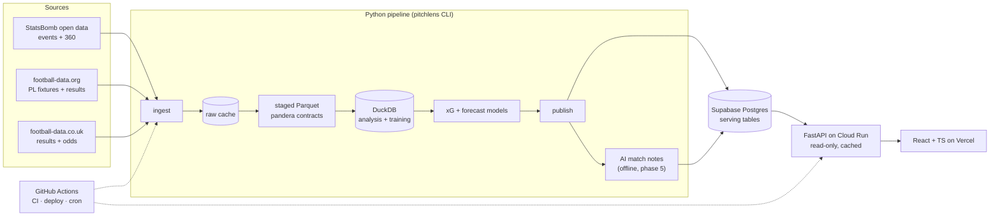

# PITCHLENS — PROJECT SPECIFICATION

> **Version:** 1.1 · **Status:** Source of truth · **Updated:** 2026-10-01 · **Current phase:** 0, Foundations (in progress)
>
> This document consolidates every PitchLens decision: the original plan page, the later technology and hosting decisions, the technology and interactive roadmaps, the Claude Project setup, and the decisions taken on 2026-10-01. It supersedes `PITCHLENS_CONTEXT.md` and both earlier artifacts. The interactive roadmap (`roadmap/index.html`) and `CLAUDE.md` are derived from this file; when they disagree, this file wins.
>
> **Changing it:** edit this file in the same commit as the change it describes. A changed **decision** also needs an ADR in `docs/adr/`. Bump the version and add a changelog line at the bottom.

---

## 0. How to read this document

### 0.1 Status markers

| Marker | Meaning |
|---|---|
| ✅ **Decided** | Agreed. Change it only with a new ADR. |
| 🟡 **Proposed** | Detailed design added to make the plan executable (schemas, endpoints, file names). The default unless someone objects; it becomes ✅ once it's built. |
| ❓ **Open** | Not decided. Listed in section 26 with the phase that needs the answer. |

Anything without a marker inherits its section heading's marker.

### 0.2 Mission

**Two software engineers → capable football data analysts → with a serious, technically strong and analytically credible public football analytics portfolio project.**

Every technology here exists because it contributes to PitchLens. Every football analytics concept is tied to something we build. If a tool or concept can't point to a file, a page or a write-up, it doesn't belong.

### 0.3 Contradictions resolved (later decision wins)

| Topic | Older plan page said | Binding decision |
|---|---|---|
| Frontend hosting | "Cloudflare Pages or Vercel" | **Vercel** (Hobby) — ADR 0002 |
| API hosting | "Google Cloud Run or Fly.io" | **Google Cloud Run** — ADR 0002 |
| Postgres usage | "the small set of tables the website needs" | **Only summary tables and shots in Postgres; full event data in Parquet** — ADR 0004 |
| Supabase projects | one implied | **Separate dev and prod projects** — ADR 0002 |
| Frontend framework | React + Vite | React + Vite, **chosen over Next.js** — ADR 0001 |
| Python packaging | uv | uv, **chosen over Poetry** — ADR 0001 |
| Orchestration | Actions cron | **CLI + scheduled GitHub Actions, chosen over Airflow** — ADR 0001 |
| Elo baseline owner | Phase 4 lane: Person A. Work-split text: Person B | **Person B builds Elo (crossover); Person A builds Dixon-Coles and the backtest** — ADR 0007 |

### 0.4 Improvements made in v1.1 (ADR 0007)

| Weakness found | Change |
|---|---|
| Phase 0 introduced Docker Compose, but Postgres isn't used until phase 2 | Compose moves to phase 2. Phase 0 stays focused on the repo, CI and a first shot map |
| Observable Plot duplicated D3: every MVP chart is a custom pitch/timeline chart | **Observable Plot removed.** D3 for all web charts; matplotlib/mplsoccer in notebooks |
| Phase 3 breaks the "≤ 2 new tools" rule badly | Split formalised into milestones **3a** (bare deployed app) and **3b** (charts) |
| Phase 6 had an open "xG v2 or player pages" | **xG v2 (360) in phase 6.** Player pages move to the post-launch backlog |
| xG methodology underspecified | Penalties, own goals, train/test split and benchmark rules fixed in section 10.2 |
| Coordinate units ambiguous (StatsBomb's 120 × 80 is not real yards) | ADR 0003: canonical frame, and physical metrics computed in metres |
| Risk that Claude implements the very skills the portfolio claims | Section 27: who implements what |

---

## 1. Product vision ✅

**One line.** PitchLens is an open football analytics lab: our own xG model, match reports anyone can read, and a forecast that publicly keeps score of itself.

**Principle.** *Show the numbers and show the method.* Every match page explains itself. The xG model is ours and benchmarked in the open. The forecast publishes its own track record, including the weeks it gets wrong.

**Problem.** Most public football stats show numbers without methods. Open advanced data got scarcer in January 2026, when FBref had to delete its Opta-powered advanced stats. Learners and fans have few places where the model, the code and its errors are all visible.

**Users, in honest order of importance:**
1. Recruiters, club analysts and hiring managers reading our portfolios.
2. Us two, as a structured way to learn.
3. Curious fans and amateur writers.

**Why it's interesting.** Two moments of accountability: we'll disagree with a professional xG model and have to explain why, and our forecasts are scored publicly.

**Layers**

| Layer | What | Data | Fragile? |
|---|---|---|---|
| Static core | xG model, match, competition and methods pages | StatsBomb open data | No |
| Live layer | Premier League forecasts with a public track record | football-data.org + football-data.co.uk | Yes, on purpose: a real pipeline to operate |
| AI layer | Short match notes describing computed numbers | Our computed stats | No: offline |
| Video lab (optional) | Per-player positions and physical metrics from our own footage | Our video | n/a: offline batch |

**Constraints ✅**
- Two engineers, about 6–10 hours a week each.
- About 16 weeks to launch, plus an optional 6-week video lab.
- Python for data work.
- Running cost of about €0–10 a month.
- Public and **non-commercial**.
- Name: **PitchLens**. ❓ Domain: Q-01.

---

## 2. MVP scope ✅ (phases 0–3)

**Done when** a stranger can open a public URL, pick a match, and understand what happened beyond the score.

| # | Feature | Definition |
|---|---|---|
| M1 | Reproducible dataset | One command ingests the three MVP competitions (ADR 0006): **UEFA Euro 2024** (competition 55 / season 282, has 360), **UEFA Women's Euro 2025** (53 / 315, has 360), **Premier League 2015/16** (2 / 27, full 380-match season) |
| M2 | xG model v1 | Logistic regression on distance, angle, body part and play type. Evaluated with log loss, Brier score and a calibration plot, side by side with StatsBomb's xG (rules in section 10.2) |
| M3 | Match page | Shot map, cumulative xG timeline, pass network, key-stats table |
| M4 | Competition page | Team xG for and against per 90, with a small-sample note |
| M5 | Methods page | Plain-language model card + data attribution (StatsBomb credit and logo) |
| M6 | Deployed with CI | Tests on every change, automatic deploy from `main`, a public URL |

**Why these competitions:**
- Premier League 2015/16 is a complete league season (Leicester's title year), so per-90 tables are honest.
- The two Euros add 360 freeze frames for xG v2 and a women's competition.
- Together they hold roughly 10,000+ shots for training.

**Not in the MVP:** forecasts, AI notes, xG v2, player pages, share images, video.

**Safe stopping point:** the end of phase 3.

---

## 3. Post-MVP scope ✅

| # | Feature | Phase | Notes |
|---|---|---|---|
| F1 | **Premier League forecasts with a track record** | 4 | Elo baseline, then Dixon-Coles; season simulations; every past forecast scored (ADR 0006) |
| F2 | **AI match notes** | 5 | Offline, faithfulness-tested (section 13) |
| F3 | **xG model v2** | 6 | LightGBM + 360 freeze-frame features; trained and evaluated on the 360 competitions |
| F5 | **Shareable images** | 6 | Chart → PNG with attribution baked in |
| F6 | **Archive-mode export** | 6 | Serving tables → static JSON |
| F4 | Player percentile pages | Post-launch backlog | Per 90 with minimum minutes; full-season competitions only (Premier League 2015/16) |
| F7 | Tracking sandbox (stretch) | Post-launch | Metrica / SkillCorner samples |
| F8 | Text-to-SQL experiment | Post-launch | Read-only DB role only |

---

## 4. Optional video-analysis phase ✅ (phase 7, weeks 17–22)

**Done when:** a 5-minute clip of our own 7-a-side game produces per-player heatmaps and distance covered, with a **published accuracy figure in metres**.

| Per-player output | Realistic? | How |
|---|---|---|
| Position over time, heatmap | Yes | Detect, track, homography to pitch |
| Distance, speed, sprints | Yes | From positions, **computed in metres** (ADR 0003); error grows with distance from the camera |
| Team shape, average positions | Yes | Team split by shirt-colour clustering |
| Who is who | With help | Manual track-naming screen (shirt-number OCR is unreliable) |
| Ball position | Partly | Gaps, filled by interpolation or by hand |
| Passes, shots, tackles | Not yet | Research problem; semi-manual tagging is the honest route |

**Rules:**
- **Footage:** our own footage from a single fixed, elevated, wide camera. **No TV broadcasts.**
- **Consent:** from everyone shown before publishing anything; anonymised IDs by default.
- **Pipeline:** YOLO-family detector fine-tuned on a few hundred labelled frames → ByteTrack → homography (pitch keypoints or clicked corners) → shirt-colour team assignment → `frame, track_id, team, x_m, y_m` (real metres) → converted to the canonical frame for charts.
- **Compute:** a GPU, as an **offline batch job**, never in the API.
- **Evaluation:** hand-label 100 frames and publish the error in metres.
- **Starting points:** Roboflow sports and SoccerNet.

---

## 5. Football analytics objectives

| # | Objective | Proven by | Phase |
|---|---|---|---|
| A1 | Read event data: event types, possessions, play patterns | Staged Parquet + contracts + EDA notebook | 1 |
| A2 | Handle coordinates correctly (ADR 0003) | Transform tests + correct shot maps | 0–1 |
| A3 | Build, evaluate and **calibrate** an xG model; avoid leakage; benchmark against a professional model | Model card + write-up #1 | 2 |
| A4 | Use per-90 rates honestly | Competition page notes | 3 |
| A5 | Build and read pass networks; know their limits | Match page | 3 |
| A6 | Rate teams (Elo, Dixon-Coles), simulate seasons, score forecasts (RPS, Brier, log loss), benchmark against bookmakers | Forecast pages, write-up #2 | 4 |
| A7 | Turn numbers into accurate prose; faithfulness | AI notes, "how to read this" texts | 5 |
| A8 | Use 360 context (defenders, keeper) with gradient boosting; explain what changes | xG v2 + write-up #3 | 6 |
| A9 | Communicate uncertainty and limitations | Methods page, model cards, write-ups | 2–6 |
| A10 | (optional) Tracking data, homography, measurement error | Video lab report | 7 |

**Reference values we reuse:**
- A penalty is about 0.76–0.79 xG.
- A 30-metre shot is about 0.02–0.04 xG.
- Per-90 numbers are unreliable below roughly 900 minutes.

---

## 6. Data sources and data strategy ✅

### 6.1 Sources

| Source | Role | Access / cost | Licensing and caveats |
|---|---|---|---|
| **StatsBomb open data** (Hudl) | **Core**: events, 360 freeze frames | Free JSON on GitHub; `statsbombpy` | Research/genuine-interest user agreement; **credit StatsBomb and use their logo when publishing**; selective coverage |
| **football-data.org** | **Live layer**: Premier League fixtures and results | Free tier, **10 requests/minute** | No player stats or xG; batch only; **cache everything; never call per page view** |
| **football-data.co.uk** | Forecast history + **closing odds** | Free CSVs | Training and the bookmaker benchmark; check terms before redistributing |
| Wyscout public dataset (2019) | Supplement | Free download | Verify the exact licence; old but full seasons |
| API-Football | Only if needed | Free: 100 requests/day | Quality varies |
| Metrica / SkillCorner samples | Stretch | Free | Too few matches to generalise |
| **FBref** | **Avoid** | — | Advanced data removed in January 2026 |
| **Understat, Sofascore, FotMob, WhoScored, Transfermarkt** | **Avoid** | Scraping only | Terms prohibit scraping and republishing |

Full register with licence links and check dates: [`docs/DATA_SOURCES.md`](DATA_SOURCES.md).

### 6.2 Rules
1. Only use data we're allowed to publish; no scraping where the terms forbid it.
2. `DATA_SOURCES.md` is rechecked before launch and each August.
3. Batch everything: no streaming, no queues.
4. Raw data is immutable and cached; reruns are idempotent.
5. **Two committed StatsBomb fixture matches** in `tests/fixtures/` (with an attribution file) for CI.
6. **Storage split** (ADR 0004): events → Parquet/DuckDB; only summary tables and shots → Postgres.
7. **Selection bias** in open data is stated on the methods page and in every model card.
8. Season rollover each August. ❓ How long the live layer runs: Q-09.

---

## 7. Final technology stack ✅

| Area | Choice | Rejected / skipped | Phase introduced |
|---|---|---|---|
| Python tooling | Python **3.12**, **uv** (workspace), ruff, mypy, pre-commit | Poetry | 0 |
| CLI | **Typer** | argparse, Click directly | 0 |
| Notebooks | **Jupyter**, outputs stripped by `nbstripout` (ADR 0005) | marimo | 0 |
| Football libraries | `statsbombpy`, `mplsoccer`; later `penaltyblog`, optionally `socceraction` | — | 0 / 4 |
| Data | pandas, **DuckDB**, **Parquet** (pyarrow), **pandera** | Spark, warehouses | 1 |
| Modelling | scikit-learn, statsmodels; LightGBM (xG v2) | Deep learning (except video) | 2 / 6 |
| Database | **Postgres on Supabase** (dev + prod), SQLAlchemy 2, **Alembic**, Docker Compose locally | Self-hosted DB | **2** |
| Backend | **FastAPI**, Pydantic v2, read-only | Django, GraphQL | 3 |
| Frontend | **React + TypeScript + Vite**, TanStack Query, **D3**, `openapi-typescript` | Next.js, **Observable Plot** (ADR 0007) | 3 |
| Containers | **One Dockerfile (API)**, Compose for local Postgres | Containerised frontend, Kubernetes | 2 / 3 |
| Hosting | **Vercel Hobby** (web), **Cloud Run** (API), **Supabase** (DB) | Cloudflare Pages, Fly.io | 3 |
| CI/CD + scheduler | **GitHub Actions**, Dependabot | Airflow, Terraform, queues | 0 / 4 |
| AI | **Claude API**, structured outputs, **pipeline only** | Browser-side LLM calls | 5 |
| Monitoring | `/health`, Actions failure emails; Sentry free tier optional | Full observability stack | 3–6 |
| Testing | pytest, Hypothesis, pandera, snapshots, httpx TestClient, Vitest, Testing Library, Playwright | — | 0–3 |
| Video (optional) | YOLO-family detector, ByteTrack, OpenCV, notebook GPU | CV inside the API | 7 |
| Docs | Markdown, Mermaid, ADRs, model cards | — | 0 |

---

## 8. Architecture ✅

**Rule:** heavy work happens in the pipeline; the API only reads precomputed tables; the frontend only draws.



**Environments:**
- **Local:** Compose Postgres.
- **Preview:** a Vercel URL for every branch. Previews call the **production API**, which is read-only and public, so no second Cloud Run service is needed (ADR 0007).
- **Production.**
- The dev Supabase project serves local development; the prod project serves production.

**Archive mode:** before maintenance stops, export the serving tables to static JSON so the site runs without a DB or API.

**Accepted trade-offs (ADR 0002):**
- A cold start on the first request after the site has been idle.
- Vercel's non-commercial and one-member limits.
- Supabase's 500 MB cap and inactivity pause (the twice-weekly forecast job keeps prod awake).

---

## 9. Database and data model 🟡

### 9.1 Analytical store (Parquet + DuckDB, not deployed)

```
data/                          # gitignored
  raw/statsbomb/{matches,events,lineups,three-sixty}/*.json
  raw/football_data_org/PL/{date}.json
  raw/football_data_co_uk/*.csv
  staged/                      # pandera-validated Parquet
    matches  events  shots  passes  lineups  freeze_frames  results  odds
  pitchlens.duckdb             # views over staged/, training sets, marts
```

**Canonical coordinates ✅ (ADR 0003):**
- **StatsBomb's 120 × 80 frame**, origin top-left, x towards the opponent's goal (goal centre at (120, 40), posts at y = 36 and 44).
- Events are oriented so the acting team attacks left → right.
- Every source converts into this frame at staging time, and nothing downstream converts again.
- Real-world distances (video, physical metrics) are computed **in metres before** conversion.

### 9.2 Serving store (Postgres, deployed)

| Table | Key columns | Purpose |
|---|---|---|
| `competition` | id, source, source_competition_id, source_season_id, name, season_name, gender | Competition list |
| `team` / `team_source_id` | id, name, short_name / team_id, source, source_team_id | One team across sources |
| `player` | id, name, source_player_id | Shooters, network nodes |
| `match` | id, competition_id, kickoff, home/away team, scores, stage, has_360 | Match list and header |
| `shot` | id, match_id, team_id, player_id, period, minute, second, x, y, end_x, end_y, body_part, play_pattern, shot_type, outcome, is_goal, xg_pitchlens, xg_statsbomb, xg_model_version | Shot map, xG timeline, comparisons |
| `team_match_stats` | match_id, team_id, shots, shots_on_target, xg, possession_pct, passes, ppda | Key numbers |
| `pass_network_node` / `_edge` | match_id, team_id, player_id, avg_x, avg_y, touches / passer_id, recipient_id, passes | Pass network (until the first substitution) |
| `team_competition_stats` | competition_id, team_id, matches, minutes, xg_for, xg_against, *_p90 | Competition page |
| `model_version` | id, kind, name, trained_at, git_sha, metrics (jsonb), card_path | Provenance |
| `fixture` | id, source_match_id, competition_code, season, matchday, kickoff, teams, status, goals | Live layer |
| `team_rating` | as_of, team_id, model_version_id, elo, attack, defence | Ratings |
| `forecast` | id, fixture_id, model_version_id, issued_at, p_home, p_draw, p_away, exp goals | **Insert-only** |
| `forecast_score` | forecast_id, rps, brier, log_loss, bookmaker_rps | Track record |
| `season_simulation` | as_of, competition_code, team_id, exp_points, p_title, p_top4, p_relegation | Season sims |
| `match_note` | match_id, text, claims (jsonb), prompt_version, llm_model, generated_at, faithfulness_passed | AI notes |

**Integrity rules (constraints + tests):**
- `forecast.issued_at < fixture.kickoff`.
- Forecasts are never updated or deleted (enforced by grants).
- `p_home + p_draw + p_away = 1 ± 1e-6`.
- `0 ≤ xg ≤ 1`.
- Every serving row traces to a `model_version` or a source.

**Size:** a few MB, far inside the 500 MB cap.

---

## 10. Data pipeline

### 10.1 CLI (`pitchlens`, Typer). Idempotent, raw files cached.

| Command | Does | Phase |
|---|---|---|
| `pitchlens info` | Version, paths, configured competitions | 0 ✅ |
| `pitchlens ingest statsbomb [--competition 55 --season 282]` | Download (or reuse the cache) → raw | 1 |
| `pitchlens ingest results --source football-data-org` | Premier League fixtures and results (rate-limited) | 4 |
| `pitchlens ingest odds --source football-data-co-uk` | Historical results + odds | 4 |
| `pitchlens validate` | Raw → staged Parquet with pandera; fail loudly | 1 |
| `pitchlens train xg` / `evaluate xg` | Train; write metrics, calibration plot and model-card inputs | 2 |
| `pitchlens publish {core,forecasts,notes} --env {dev,prod}` | Upsert serving tables (forecasts insert-only) | 2–5 |
| `pitchlens forecast update --score-last-round` | Refit, score the last round, issue forecasts, simulate | 4 |
| `pitchlens notes generate` | Stats JSON → Claude API → faithfulness check → store | 5 |
| `pitchlens export archive` | Serving tables → static JSON | 6 |

The static core is published by a manual **`publish-core.yml`** workflow using cached raw data, never from a laptop (ADR 0007).

### 10.2 Modelling rules ✅ (ADR 0007)

**xG v1:**
- Logistic regression on distance, angle, body part and play type.
- **Penalties** are excluded from training and assigned a constant xG (their empirical conversion rate, documented).
- **Own goals** are not shots.
- **Train/test split by match** (never by shot); **Women's Euro 2025 is a held-out competition** as a second generalisation check.
- **Benchmark:** compare with StatsBomb xG on the same shots using log loss, Brier and calibration, and discuss the disagreements.

**xG v2:** LightGBM + 360 features (defenders in the shot cone, keeper position), on the 360 competitions only, compared with v1 on the same shots.

**Forecasts:**
- Elo baseline (Person B), then Dixon-Coles via `penaltyblog` (Person A).
- Backtest on historical Premier League seasons **without look-ahead**.
- **RPS** is the primary score; Brier and log loss are secondary.
- Benchmark against **closing-odds implied probabilities with the overround removed**.

---

## 11. Backend ✅

FastAPI, **read-only**, Pydantic v2, SQLAlchemy 2, one Docker image on Cloud Run. **API contract first:** agree the OpenAPI spec plus example JSON before building.

**Endpoints 🟡** (`/v1`):

```
GET /health
GET /v1/competitions
GET /v1/competitions/{id}/matches
GET /v1/competitions/{id}/team-stats
GET /v1/matches/{id}
GET /v1/matches/{id}/shots
GET /v1/matches/{id}/pass-network
GET /v1/matches/{id}/note
GET /v1/models/{kind}/current
GET /v1/forecasts/{competition}/upcoming
GET /v1/forecasts/{competition}/track-record
GET /v1/forecasts/{competition}/season-simulation
```

**Rules:**
- `Cache-Control` on every response.
- The API connects as the `api_reader` role.
- Indexed lookups only.
- CORS limited to the production and preview domains.
- No auth: the data is public and read-only.
- CI fails if the generated TypeScript types are stale.

---

## 12. Frontend ✅

React + TypeScript + Vite, built statically and hosted on Vercel. TanStack Query; **D3 for every web chart** (shot map, xG timeline, pass network, forecast charts); types from `openapi-typescript`.

| Route | Phase | Content |
|---|---|---|
| `/` | 3 | Landing, competitions, featured match |
| `/competitions/:id` | 3 | Team xG per 90 + small-sample note |
| `/matches/:id` | 3 (+5) | Header, shot map, xG timeline, pass network, key numbers; AI note from phase 5 |
| `/methods` | 3 | Model cards, data sources, StatsBomb attribution, "how to read this" |
| `/forecasts/premier-league` | 4 | Upcoming probabilities, season simulation |
| `/forecasts/premier-league/track-record` | 4 | Every past forecast scored; RPS vs bookmaker |
| `/lab/video` | 7 | Video-lab results |

**Design language:**
- Colours: cobalt `#2346E8` (home), coral `#E8473B` (away and goals), turf `#0B8C68`, sun `#B88600`, violet `#6A4BF0` (AI-written).
- Fonts: Unbounded (display) and Schibsted Grotesk (body).
- Light and dark themes.

**Quality bar:** mobile, accessible, `prefers-reduced-motion`, StatsBomb attribution wherever their data appears.

---

## 13. AI usage ✅

**Rule:** conventional methods produce every number; language models only describe numbers that already exist.

| AI adds value | Conventional is more reliable |
|---|---|
| Match notes (~80 words): offline, structured output, stored | xG and any probability |
| "How to read this" texts (drafted, then edited by us) | Forecasts (Elo, Dixon-Coles) |
| Learning concepts; checking reasoning | Rankings, percentiles, per 90 |
| Building faster (Claude Code) | Data cleaning |

**Faithfulness test:**
- Structured output returns the note text plus its claims.
- Every number in the note must appear in, or be directly derivable from, the input JSON.
- Notes that fail are regenerated or dropped.
- Every published note is labelled AI-written.
- CI uses a mocked client.

**Cost:** a few euros in total. Keys live only in the pipeline. The model is chosen in phase 5 and recorded in an ADR.

**AI tools for building PitchLens:**

| Tool | Use | Status |
|---|---|---|
| Claude Code | Coding agent in the repo; follows `CLAUDE.md` | Essential |
| Claude chat + shared Project | Learning, checking evaluation choices, drafting write-ups. Knowledge: this spec, the StatsBomb event spec, ADRs, model cards | Essential |
| GitHub (Issues, Projects, Actions) | Coordination, CI/CD, scheduling | Essential |
| Mermaid in the repo | Diagrams as code | Essential |
| Context7 connector | Current library docs | Recommended |
| Claude Design **or** Figma | Mockups and share templates (choose one) | Optional |
| Supabase connector | **Dev project only** | Optional |
| Google Drive / Calendar | Drafts, weekly call | Optional |
| Claude API | Match notes | Phase 5 |
| Second coding assistant, AI image generators | — | Skip |

---

## 14. Testing strategy ✅

Tests exist to catch **silently wrong numbers**.

| Layer | What | Tools | Location |
|---|---|---|---|
| Transforms | Coordinates, angle/distance vs hand-calculated cases, own goals, penalties, extra time | pytest | `pipeline/tests/unit/` |
| Invariants | 0 ≤ xG ≤ 1; H/D/A probabilities sum to 1; team totals = sum of player totals | Hypothesis | `pipeline/tests/property/` |
| Data contracts | Columns, types, ranges, unique IDs | pandera | `pipeline/src/pitchlens/schemas/` |
| End to end | Ingest → publish on the 2 fixture matches vs a snapshot | pytest | `pipeline/tests/e2e/` |
| Model quality | Fixed sample and seed; log loss must not regress past the baseline + tolerance | pytest | `pipeline/tests/model/`, `models/baselines.json` |
| Forecast honesty | `issued_at < kickoff`; insert-only; RPS on hand-worked examples | pytest | `pipeline/tests/forecast/` |
| API | Status codes, schemas, 404s, query performance | pytest + httpx + Compose Postgres | `api/tests/` |
| Frontend | Pitch scales, chart rendering, one match-page smoke test | Vitest, Testing Library, Playwright | `web/` |
| AI notes | Faithfulness on every note; stored examples | pytest, mocked client | `pipeline/tests/notes/` |
| Video | Homography on known points; error ≤ the published figure | pytest | `video/tests/` |

**Phase 0 baseline:** CLI smoke tests and repo-hygiene tests run in CI from the first commit.

---

## 15. CI/CD ✅

| Workflow | Trigger | Steps | Phase |
|---|---|---|---|
| `ci.yml` | Every push and pull request | uv sync → ruff check + format check → mypy → pytest (later also: frontend tests, Docker build, API-type freshness) | 0 ✅ |
| `deploy.yml` | Push to `main` | Migrations → build and push the image → deploy Cloud Run → Vercel builds → Playwright smoke against prod | 3 |
| `publish-core.yml` | Manual | Ingest from cache → validate → train/evaluate → publish core | 2–3 |
| `forecast.yml` | `cron: "0 6 * * 2,5"` + manual | ingest results → validate → `forecast update --score-last-round` → publish forecasts | 4 |

Also: Dependabot (uv + GitHub Actions) ✅ from phase 0.

---

## 16. Deployment ✅

| Piece | Host | Cost | Catches |
|---|---|---|---|
| Frontend | **Vercel** Hobby | Free | Non-commercial; one member. **João (Person B) owns the Vercel project**; the repo stays public so everyone's commits deploy |
| API | **Cloud Run** | Free tier | Cold starts; low `max-instances` + a billing alert |
| Database | **Supabase** dev + prod | Free | 500 MB cap; inactivity pause |
| CI and scheduling | **GitHub Actions** | Free (public repo) | Cron delays |
| Images | Artifact Registry | Cents a month | Prune old images |

Total: about €0–10 a month. ❓ GCP account/billing owner and region: Q-10.

---

## 17. Security and secrets

| Secret | Lives in | Used by |
|---|---|---|
| `FOOTBALL_DATA_TOKEN` | GitHub Actions secrets | `forecast.yml` |
| `DATABASE_URL` (prod, `pipeline_writer`) | Actions secrets (environment `production`) | publish jobs |
| `DATABASE_URL` (prod, `api_reader`) | GCP Secret Manager → Cloud Run | API |
| `MIGRATION_DATABASE_URL` (`migrator`) | Actions secrets (`production`) | `deploy.yml` |
| `ANTHROPIC_API_KEY` | Actions secrets / local `.env` | `notes generate` only |
| GCP deploy identity | Workload Identity Federation (no JSON keys) | `deploy.yml` |
| `VITE_API_BASE_URL` | Vercel env (public) | frontend |

**Rules:**
- No keys in the browser.
- Three Postgres roles: `migrator`, `pipeline_writer` (no UPDATE or DELETE on `forecast`) and `api_reader` (SELECT only).
- **Supabase Data API disabled** (or RLS on with no policies).
- `.env` is gitignored and `.env.example` is committed.
- Secret scanning and push protection enabled.
- Connectors point at **dev** only.
- Video: consent and anonymised IDs.

---

## 18. Git and GitHub workflow

**Repository:** public monorepo `azeredo-99/PitchLens`, **MIT licence** (ADR 0006). The code is MIT; the data keeps its own terms.

```
PitchLens/
  pipeline/                 # Python package `pitchlens` (CLI, ingest, transform, models, publish, notes)
    src/pitchlens/
    tests/
  api/                      # phase 3: FastAPI + Dockerfile + Alembic migrations
  web/                      # phase 3: React + Vite
  notebooks/                # Jupyter, YYYY-MM-DD-topic.ipynb, outputs stripped
  models/                   # baselines.json, cards/
  roadmap/index.html        # interactive learning/build roadmap
  docs/
    SPEC.md  DATA_SOURCES.md
    adr/  diagrams/  writeups/
  tests/fixtures/           # two StatsBomb matches (phase 1)
  .github/workflows/        # ci.yml (+ deploy, publish-core, forecast later)
  pyproject.toml            # uv workspace root
  CLAUDE.md  README.md  LICENSE
```

**Rhythm ✅:**
- A GitHub Projects board with small issues.
- A weekly 30-minute call.
- Everything else asynchronously.
- Pair on coordinates, model evaluation and the faithfulness test.

**Branches:**
- `main` is protected: green CI and one approval.
- Short-lived branches: `feat/`, `fix/`, `docs/`, `data/`.
- Squash merge; Conventional Commit titles.
- Claude works on its designated `claude/…` branch and commits there directly; you merge it into `main` when you're ready.

**Labels:** `track:*`, `phase:*`, `analytics-check`. The PR template asks: does this change a published number, and which test proves it is right?

---

## 19. The 8 project phases ✅

Person A = data and models lead (**repository owner**). Person B = product and platform lead (**João**).

| Phase | Weeks | Person A | Person B | Done when |
|---|---|---|---|---|
| **0 · Foundations** | 1 | Register for StatsBomb open data, read the event spec, load one match in a notebook, draw a shot map with mplsoccer | Monorepo, uv, pre-commit, CI skeleton, PR template, project board, first match-page mockup | Both run the repo locally; CI green; A's shot-map notebook merged |
| **1 · Data foundations** | 2–3 | Ingest the 3 MVP competitions to Parquet, pandera contracts, 2 fixture matches, shots EDA notebook | Pipeline CLI commands, raw-file caching, DuckDB views, end-to-end fixture test in CI | One command rebuilds the dataset and CI validates it |
| **2 · First xG model** | 4–6 | Features, logistic regression, StatsBomb benchmark, calibration plot, model card | Training as a pipeline step, metrics regression test, **Docker Compose Postgres**, Alembic serving schema, `publish core --env dev` | Write-up #1 drafted: "Our xG model vs a professional one" |
| **3 · App MVP, deployed** | 7–9 | Pass networks and per-90 team tables in the pipeline; competition page frontend | **3a:** FastAPI endpoints, generated TS types, bare match list deployed (Cloud Run + Vercel + Supabase prod). **3b:** match page with D3 shot map and xG timeline, Playwright smoke | Public URL. **Safe stopping point** |
| **4 · Live forecasts** | 10–11 | **Dixon-Coles**, backtest on historical PL seasons, bookmaker comparison | **Elo baseline** (crossover), football-data.org client with rate limiting, `forecast.yml`, forecast and track-record pages | The cron has run twice unattended; write-up #2 started |
| **5 · AI match notes** | 12–13 | Which stats feed the prompt; reviews notes for accuracy; "how to read this" texts | Generation step, structured output, faithfulness test, UI labelling | Every published note passes the number check |
| **6 · Polish and launch** | 14–16 | **xG v2 with 360 features**; final write-ups | Accessibility, performance, mobile, share images, README, demo video, archive export | You'd send the link to a hiring manager at a club |
| **7 · Video lab (optional)** | 17–22 | Frame labelling, error in metres, heatmaps and physical metrics | Detection, tracking and homography as an offline GPU job; upload and track-naming screen | 5-minute clip → heatmaps + distances + published accuracy |

**Rule:** no more than two unfamiliar tools at once per person. Phase 3 is the exception, handled by the 3a/3b split.

**Maintenance:** about an hour a week while the forecast runs, plus a few hours each August.

---

## 20. Technology learning roadmap

Each technology is listed with the PitchLens artifact that justifies it.

| Phase | Technology | Lead | Justified by |
|---|---|---|---|
| 0 | Git + GitHub flow, uv, ruff, mypy, pre-commit, GitHub Actions, Dependabot | B | Two people, one codebase, green CI from day one |
| 0 | Jupyter + nbstripout, statsbombpy, mplsoccer | A | First shot map |
| 1 | pandas, Parquet, DuckDB | A + B | Staged dataset, SQL over files |
| 1 | pandera, pytest, Hypothesis, Typer | A + B | Contracts, transform tests, CLI |
| 2 | scikit-learn, statsmodels | A | xG v1, calibration |
| 2 | Docker Compose, Postgres, SQLAlchemy 2, Alembic | B | Serving tables |
| 3a | FastAPI, Pydantic v2, openapi-typescript, Dockerfile, Cloud Run, Vercel, Supabase | B | Deployed read-only API + bare site |
| 3b | React, TypeScript, Vite, TanStack Query, D3, Vitest, Playwright | B (match page), A (competition page) | Charts and pages |
| 4 | football-data.org, football-data.co.uk, penaltyblog, scheduled Actions | A (models), B (client, Elo, cron) | Forecasts + benchmark |
| 5 | Claude API (structured outputs) | B | Match notes |
| 6 | LightGBM + 360 data; Lighthouse; static export | A / B | xG v2; launch quality; archive mode |
| 7 | YOLO-family detector, ByteTrack, OpenCV, notebook GPU | B | Video pipeline |
| 7 | Frame labelling, error evaluation | A | Accuracy figure |

---

## 21. Football analytics learning roadmap ✅

| Phase | Concepts | Built into | Evidence |
|---|---|---|---|
| 0 | Event data; StatsBomb event spec; pitch coordinates; xG intuition | Notebook shot map | Shot map of one match |
| 1 | Event types, possessions, play patterns; selection bias; data quality | Staged Parquet + contracts | EDA notebook answering 3 questions about shots |
| 2 | xG features; logistic regression; log loss, Brier; **calibration**; **leakage**; benchmarking | xG v1 | Model card + write-up #1 |
| 3 | Reading shot maps and xG timelines; pass networks and their limits; **per 90**, minimum minutes; PPDA | Match + competition pages | "How to read this" texts |
| 4 | Elo; Poisson and **Dixon-Coles**; home advantage; time decay; Monte Carlo seasons; **RPS**; implied probability and overround; look-ahead-free backtesting | Forecasts + track record | Write-up #2 |
| 5 | Which numbers tell the story; uncertainty in prose; faithfulness | AI notes | Notes passing the number check |
| 6 | 360 freeze frames; gradient boosting; communicating limitations | xG v2 | Write-up #3: "What 360 data changes about chance quality" |
| 7 | Tracking data; homography; physical metrics; measurement error | Video lab | Accuracy report |
| Stretch | xT, VAEP (`socceraction`); player percentiles | Post-launch | Notebook / player pages |

---

## 22. Person A / Person B responsibilities ✅

| | Person A: data and models lead | Person B: product and platform lead |
|---|---|---|
| **Who** | Repository owner | João |
| **Owns** | Ingestion, data contracts, xG and forecast models, analytical write-ups | API, frontend, CI/CD, deployment, AI integration, Vercel project |
| **Crossover** | Builds the competition page frontend | Builds the Elo baseline; co-writes write-up #2 |
| **Final say on** | Whether a number is right | Whether something is shippable |

**Shared:** pairing on coordinates, model evaluation and the faithfulness test; reviewing each other's work; the weekly call. B reviews every model change using the "Analytics check".

---

## 23. Portfolio deliverables ✅

**Shared project:**
- A README with a 20-second GIF, the live link, a pitch, the architecture diagram, how to run it, attribution and "what we learned".
- On-site methods page and model cards.
- A 90-second demo video.

**Write-ups (they carry more weight than the app):**
1. "We built an xG model and compared it with a professional one: here's where we disagree and why" (phase 2).
2. "Scoring our Premier League forecasts after ten rounds" (phase 4+).
3. "What 360 data changes about chance quality" (phase 6).
4. (phase 7) "How accurate is a single-camera tracker?"

**Individual case studies:** each person writes a "my role" page: the problem owned, 2–3 decisions with trade-offs, key commits, and one thing they'd do differently. CV bullets should be specific.

**Next:** research calls such as Hudl's Performance Insights.

---

## 24. Documentation, ADR and model-card strategy ✅

| Document | Where | When |
|---|---|---|
| This spec | `docs/SPEC.md` | Same commit as any change it describes |
| ADRs | `docs/adr/NNNN-title.md` (index in `docs/adr/README.md`) | Every real decision |
| Data sources | `docs/DATA_SOURCES.md` | Phase 0; rechecked before launch and each August |
| Model cards | `models/cards/*.md`, also shown on `/methods` | End of phases 2, 4, 6 |
| Diagrams | Mermaid in docs | With the code |
| `CLAUDE.md` | Repo root | Updated when conventions change |
| Interactive roadmap | `roadmap/index.html` (also published as an artifact) | When phases, topics or ownership change |
| Claude Project knowledge | This spec + StatsBomb event spec + ADRs + model cards | Re-upload after each phase |
| Write-ups | `docs/writeups/` | Phases 2, 4, 6, 7 |

**ADRs so far:**
- 0001 Record decisions; monorepo and core tooling
- 0002 Hosting
- 0003 Coordinates
- 0004 Storage split
- 0005 Notebooks
- 0006 MVP data, forecast league, licence, roles
- 0007 Scope and sequencing v1.1

**Upcoming ADRs:**
- xG v1 features and evaluation results (phase 2)
- Forecast model and scoring (phase 4)
- LLM model and faithfulness policy (phase 5)

**Model card template:** purpose; data (competitions, shot counts, selection bias); features; split; metrics (log loss, Brier, calibration, benchmark); blind spots; version + git SHA; date.

---

## 25. Definition of Done ✅

**Every change (commit to `main` / merged branch):**
- [ ] CI green
- [ ] Reviewed by the other person (or, for Claude's branch, by the repository owner before merging)
- [ ] New logic has tests; a changed published number has a test that would catch it being wrong
- [ ] No secrets; no new data source without a `DATA_SOURCES.md` entry
- [ ] Spec, ADR and roadmap updated if a decision changed

**Every phase:**
- [ ] The phase's "done when" is met (section 19)
- [ ] Something showable exists
- [ ] Spec status line, `CLAUDE.md`, the Claude Project knowledge and the roadmap progress updated

**MVP (end of phase 3):** public URL; match, competition and methods pages with attribution; xG v1 model card; write-up #1 drafted.

**Launch (end of phase 6):**
- MVP + an unattended forecast with a public track record
- Faithfulness-checked, labelled notes
- xG v2
- README, GIF and demo video
- ≥ 2 write-ups and 2 case studies
- Mobile, accessibility and performance pass
- Archive export works
- Data sources rechecked

**Video lab:** 5-minute clip → heatmaps and distances + published accuracy; consent recorded.

---

## 26. Decision register

| ID | Question | Status | Answer |
|---|---|---|---|
| Q-01 | Domain / name availability | ❓ Open, needed in phase 3 | Use `*.vercel.app` until then |
| Q-02 | MVP competitions | ✅ ADR 0006 | Euro 2024, Women's Euro 2025, Premier League 2015/16 |
| Q-03 | Forecast league | ✅ ADR 0006 | Premier League |
| Q-04 | Phase 6: xG v2 or player pages | ✅ ADR 0007 | xG v2; player pages after launch |
| Q-05 | Jupyter or marimo | ✅ ADR 0005 | Jupyter + nbstripout |
| Q-06 | Which API previews call | ✅ ADR 0007 | Production API (read-only) |
| Q-07 | Elo owner | ✅ ADR 0007 | Person B; Dixon-Coles by Person A |
| Q-08 | Where the static core is published from | ✅ ADR 0007 | `publish-core.yml` manual workflow |
| Q-09 | How long the live layer runs | ❓ Open, needed in phase 6 | Recommendation: one full season after launch |
| Q-10 | GCP account/billing owner, region | ❓ Open, needed in phase 3a | Recommendation: João (Person B); region near Supabase prod |
| Q-11 | Code licence | ✅ ADR 0006 | MIT |
| Q-12 | Who is A / B | ✅ ADR 0006 | A = repository owner, B = João |

---

## 27. Working with Claude ✅ (default; change it by asking)

The portfolio claims we can do football analytics, so the **analytical core is written by us**. Claude handles the scaffolding around it.

| Claude implements directly | Claude prepares; A/B implement; Claude reviews |
|---|---|
| Repo scaffolding, tooling, CI/CD, Dependabot, templates | Feature engineering, xG and forecast models |
| CLI plumbing, caching, I/O, configuration | Evaluation choices and their interpretation |
| Schema migrations, API boilerplate, deploy workflows | Notebooks (EDA, calibration, backtests) |
| Test scaffolding, fixtures, contract skeletons | Write-ups, model cards, "how to read this" texts |
| The roadmap, spec, ADRs and docs upkeep | Chart design decisions |

For analytics tasks, Claude writes an **exercise brief** (goal, inputs, hints, acceptance tests), and the owner does the work. Claude reviews the result with the "Analytics check".

---

## Current status

- **Phase 0 · Foundations: in progress.**
  - ✅ Spec, ADRs, data-source register and interactive roadmap in the repo.
  - ✅ Python workspace, `pitchlens` CLI skeleton, pre-commit, CI and Dependabot.
  - ⏳ To do:
    - Person A: shot-map notebook exercise (`notebooks/README.md`).
    - Person B (João): PR template review, project board, match-page mockup.
    - Repository owner: enable branch protection and secret scanning.

## Changelog

- **v1.1 (2026-10-01):** Decisions Q-02, Q-03, Q-11 and Q-12 answered by the team. Q-04 to Q-08 decided and recorded in ADRs 0005–0007. Improvements: Compose moved to phase 2, Observable Plot removed, phase 3a/3b, xG v2 chosen for phase 6, xG methodology rules, coordinate units. Added section 27 and the current status.
- **v1.0 (2026-10-01):** First consolidated specification.
